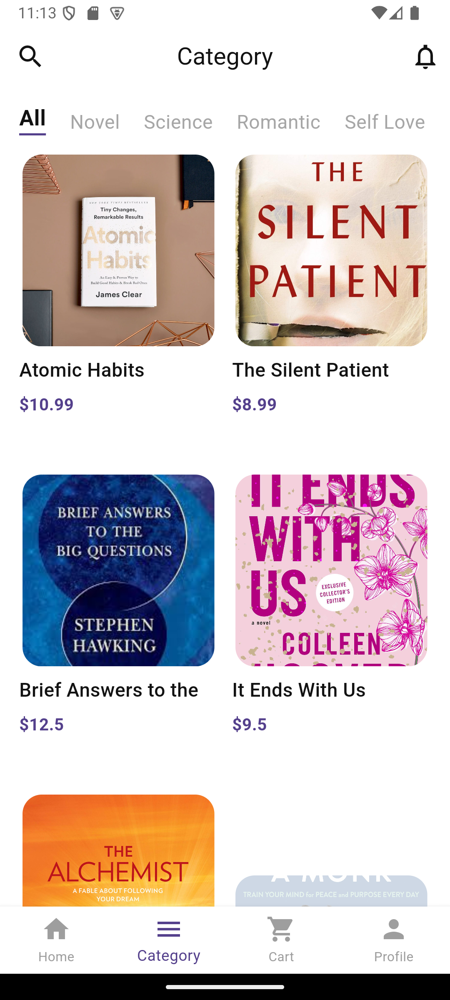
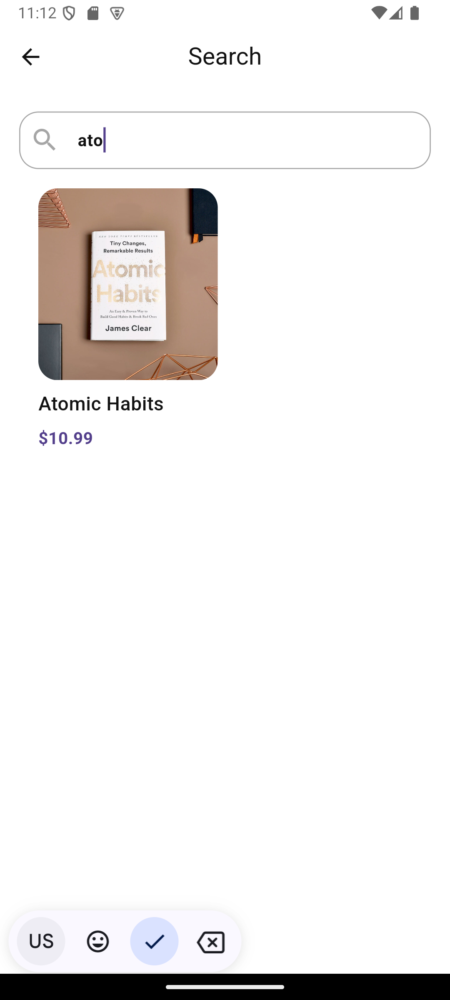
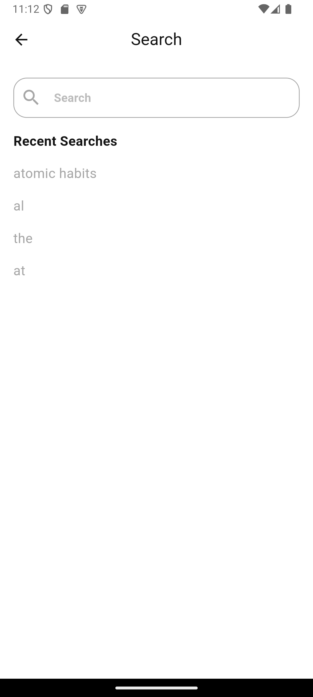

# 📚 Book App

تطبيق **Book App** هو تطبيق مخصص لاستعراض الكتب حسب الأقسام، مع إمكانية البحث عن الكتب وتخزين آخر 10 عمليات بحث في قاعدة بيانات محلية **SQLite**.  
يهدف التطبيق إلى تسهيل تصفح الكتب والوصول السريع إليها بطريقة منظمة وسهلة الاستخدام.

---

## ✨ المميزات

- 🔹 عرض الأقسام بشكل أفقي وسلس.
- 🔹 تصفية الكتب حسب القسم المحدد.
- 🔹 البحث عن الكتب داخليًا.
- 🔹 حفظ آخر 10 عمليات بحث باستخدام SQLite.
- 🔹 واجهة حديثة ومتجاوبة تدعم مختلف الشاشات.
- 🔹 استخدام **Cubit + Bloc** لإدارة الحالة بكفاءة.

---

## 🧩 التقنيات المستخدمة

- **Flutter** (UI Framework)
- **Bloc/Cubit** (State Management)
- **SQLite** (لتخزين عمليات البحث)
- **Dio / HTTP** (لجلب البيانات من الـ API)
- **GetIt** (Dependency Injection)
- **ScreenUtil** (لتصميم واجهة متجاوبة)
- **Flutter Bloc** (لإدارة الحالة بشكل منظم)

---

#### 📱 لقطات من التطبيق

  

    
الواجهات

    
    
    
  

 

 

 